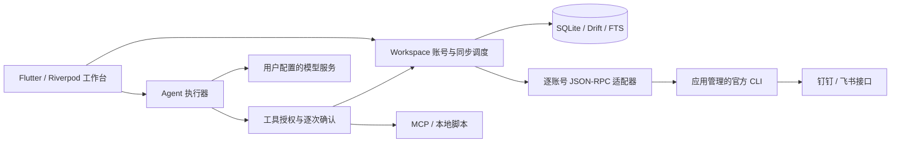

# Imbroglio

Imbroglio 是面向 macOS、Windows 和 Linux 的 Flutter 桌面 IM 与 Agent 工作台。通过独立适配器进程调用官方钉钉 `dws` 和飞书 `lark-cli`，在一个本地工作区内管理多个账号、阅读与检索消息，并由 Agent 完成资料分析和经确认的业务操作。

消息、会话、检索索引和执行记录保存在本地；使用 Agent 时，所选资料会发送至用户配置的模型服务。应用不要求终端预装 Node、Go、dws 或 lark-cli，官方 CLI 由插件管理器安装和管理。

本文描述当前源码的设计与实现。`dist/` 中已有的包不一定包含最新改动，交付时应从当前源码重新构建。历史验证证据见 [验证记录](docs/VALIDATION.md)，不代表所有平台和真实租户均已完成最新版本验收。

## 开始使用

1. 启动应用，在「插件」安装所需的官方钉钉或飞书 CLI。
2. 到「设置 → 账号与授权」添加账号，完成授权并设置便于区分的账号名称。
3. 在消息页选择账号和会话，阅读缓存、发送消息、查看同步状态；需要跨会话查资料时使用检索页。
4. 使用 Agent 前，在「设置」填写兼容 Chat Completions 的模型地址、模型名称、API 密钥和上下文限制。模型地址使用 HTTPS，本机服务可使用 HTTP。
5. 在 Agent 输入区选择插件和账号范围，提交任务；需要写入外部系统的操作先核对预览，再确认执行。

内置 Agent 包括「通用工作助手」「会话总结」「待办提取」。可以在插件相关界面创建或编辑自己的 Agent / skill，也可配置 MCP 工具服务器。

## 消息与资料

### 多账号和消息交互

- 支持钉钉、飞书多账号接入，按账号隔离适配器进程、配置、缓存和工作目录。
- 提供会话列表、关注会话、历史加载、联系人查询、文本与 Markdown、结构化富文本、引用回复、图片预览及附件发送和下载。实际展示能力取决于平台返回字段与授权范围，未知卡片保留文本摘要。
- 单条消息支持文本选择和复制。平台未读与「本应用未读」分别标识，本地阅读位置持久化；不把缺失的平台已读状态推断为已知，也不写回未验证的平台已读接口。
- 发送前持久化发送记录，区分成功、失败和未知结果。超时或中断不自动重发，应先核对原平台记录。
- 本地消息检索与可选的在线资料搜索按所选账号执行，结果附带账号和来源，可读取正文或打开可用的原始链接。缓存和授权范围有限，不等同企业全量知识库。

### 同步策略

钉钉与飞书统一采用轮询，当前不创建实时消息订阅。不同 IM 插件独立调度，历史补齐与近期消息检查分开执行。

| 调度层 | 当前策略 |
| --- | --- |
| 活跃会话发现 | 每 15 秒查询最新活跃会话，发生变化的会话进入检查队列 |
| 近期消息检查 | 近 1 小时有消息的会话每 30 秒检查，选中会话每 5 秒检查 |
| 全量检查 | 启动时及每 3 小时枚举并排队检查所有会话 |
| 历史补齐 | 自动分页缓存近 7 天；「加载更早消息」可主动读取更早记录 |

以上为调度间隔，不是消息到达时限保证。实际延迟取决于会话数量、CLI 耗时、权限和限流。分页检查点与增量检查点分别保存，消息按来源 ID 去重；存在缺口时不视为完整历史。

### 会话黑名单

会话列表右键可按当前账号和会话名称快速加入黑名单；在「设置 → 会话黑名单 → 管理规则」新增、编辑、删除和预览规则。

规则可限定账号，支持通配符（`*`、`?`）和正则，区分大小写。通配符匹配完整名称，正则匹配名称中的任意部分；会话改名后重新匹配。命中后停止自动拉取和历史补齐，保留会话及已缓存消息。主动打开会话、手动拉取或加载更早消息仍可读取，不会解除黑名单。

### 通知、活动与网络恢复

- 新消息通知遵循原平台免打扰状态，消息同步和未读统计照常进行。通知前按需刷新状态，缓存 60 秒；首次状态未知时暂不通知。
- 底部活动栏展示正在执行的任务与后台同步，详情按需展开。活动摘要仅保留本次运行；故障诊断单独持久化，提供查看和复制入口，最多保留 200 条。
- 临时断网或 DNS 故障时，按账号暂停批量后台同步，以 30 秒起、最长 5 分钟的指数退避执行只读恢复探测；成功后从原检查点继续，不自动重发消息。
- macOS 使用系统 `NWPathMonitor` 检测网络路径。系统报告离线时暂停新的 IM 请求，缓存仍可阅读；恢复后自动继续，也可点击「尝试恢复」。已发出的请求可能继续完成或超时；路径可用但服务不可达时仍按账号退避。Windows/Linux 当前使用请求失败后的退避恢复。

## Agent 工作台

先在「设置」配置兼容 Chat Completions 的模型服务。输入卡片底栏可选择 Agent 插件，点击「N 个账号」选择本次使用的资料范围。已有会话需要更换账号范围时，先点击顶部「新会话」；「历史会话」可打开已保存的对话。

### 对话与输入

- 顶部显示会话标题及新会话、历史入口；对话区居中限宽，用户消息靠右，Agent 回复直接展开。
- 底部输入卡片保持可见，包含插件选择、账号范围、发送和停止按钮。点击发送或按 `⌘ + Enter` / `Ctrl + Enter` 提交，`Enter` 换行；空内容不可发送。
- 新会话提供「总结最近的会话」「查找相关资料」「整理待办事项」快捷入口，点击填入输入框，编辑后发送。
- 流式回复在阅读位置接近底部时自动跟随；向上浏览已有内容时不强制滚回底部。
- 回复支持 Markdown、文本选择和一键复制原始 Markdown，流式输出同样支持。复制成功会显示提示。

### 执行过程与引用

- 连续多轮工具调用合并为默认收起的「执行过程 · N 次工具调用」。展开后显示中间说明和工具列表，每个工具的参数、结果可继续展开；内容区最高 320px，超出后内部滚动。
- 引用默认只显示「参考来源 · N」。展开后按引用编号列出来源，标题单行省略，点击打开原文；列表最高 240px，超出后内部滚动。切换会话后默认收起。
- 最终回复、错误提示和操作确认不放入过程折叠区。对外写入、MCP 工具调用和本地脚本执行仍按原有规则等待确认。

### 网络失败与重试

模型请求遇到网络异常、超时、响应中断或临时 HTTP 错误（408、429、500、502、503、504）时，最多自动重试两次，分别等待 1 秒、2 秒；等待期间可停止。认证等非临时错误不自动重试。

自动重试仍失败时，可在当前会话点击「重试并继续」。重试沿用原提问和已完成的工具结果，丢弃未完整接收的回复与工具调用，不自动重放工具操作。手动继续入口仅保留在当前打开的会话中；重新加载历史会话后不恢复该入口。此机制针对模型请求，不替代 MCP 连接或业务工具自身的错误处理。

## 插件与扩展

| 类型 | 能力与管理方式 |
| --- | --- |
| 官方 IM CLI | 下载与 SHA-256 校验、命令能力探测、独立版本目录、启停、升级及上一版回滚 |
| 第三方 IM 插件 | 手动导入 ZIP，通过逐行 JSON-RPC 协议提供 IM 能力 |
| Agent / skill | 内置编辑器创建与修改指令、工具、技能引用、MCP 范围和脚本；也支持目录导入 |
| MCP 服务器 | 本地 stdio、远程 Streamable HTTP、连接测试、工具发现及凭据安全存储 |
| 本地脚本 | 显式声明路径和解释器，启用工作区脚本开关后使用；每次执行仍需确认 |

MCP 工具不受 IM 账号范围约束，所有 MCP 工具调用均需逐次确认。本地脚本和第三方可执行插件拥有当前用户进程权限，独立进程不是安全沙箱。当前没有公共插件市场或发布者签名信任库；文件摘要用于完整性校验。

定义格式、导入方式、审批边界和协议约束见 [插件协议](docs/PLUGIN_PROTOCOL.md)。

## 架构与本地数据



默认工作区位于系统 Application Support 目录下的 `workspace/`，保存 `imbroglio.sqlite`、插件版本、账号配置、缓存、下载文件、备份及启动耗时记录。工作区使用文件锁，避免多个进程同时同步。SQLite 以账号与资源 ID 组合标识记录，使用 FTS5 与短文本子串检索。

模型密钥及相关工具凭据使用系统安全存储；消息数据库未整体加密。CLI 按应用管理的绝对路径启动，不依赖系统 PATH，也不自动导入或重置系统 CLI 配置。账号目录隔离不保证系统凭证命名空间完全隔离，同一账号的登录或退出仍可能影响系统 CLI。

账号退出保留本地历史。在「设置 → 账号与授权」使用「删除账号及本地数据」可清理账号记录、索引、附件、配置、备份及涉及该账号的整个 Agent 会话；已退出账号也可清理。默认同时注销登录，取消该选项仅清理本地。云端消息及另行导出的文件不在清理范围内。

代码入口：

| 路径 | 职责 |
| --- | --- |
| `lib/src/ui/` | 消息、搜索、Agent、插件与设置、活动详情等界面 |
| `lib/src/services/workspace.dart` | 账号生命周期、同步调度、消息发送和网络恢复 |
| `lib/src/services/agent.dart` | 模型流式请求、工具循环、重试与确认流程 |
| `lib/src/services/` | 存储、插件、Agent 扩展、MCP、桌面集成与启动管理 |
| `lib/src/core/` | 数据模型、协议、审批、诊断、消息规范化和展示规则 |
| `bin/` | 独立 IM 适配器及官方 CLI 命令适配 |
| `assets/plugins/` | 内置 Agent 定义 |
| `test/`、`tool/` | 回归测试、适配器构建、平台打包和辅助验证 |

更多设计说明见 [架构与验收范围](docs/ARCHITECTURE.md)。

## 开发运行

仓库使用 Flutter 3.41.5 / Dart 3.11.3。首次运行先编译独立适配器：

```sh
flutter pub get
dart run tool/build_adapter.dart
flutter run -d macos
```

Windows / Linux 将设备改为 `windows` / `linux`。修改适配器后需重新编译并完整重启应用，Flutter 热重载不会替换已经运行的适配器进程。

Linux 构建依赖：

```sh
sudo apt-get install clang cmake ninja-build pkg-config libgtk-3-dev libx11-dev libxi-dev libayatana-appindicator3-dev libnotify-dev libsecret-1-dev
```

Linux 密钥存储需要可用的 Secret Service。GNOME 托盘需要 AppIndicator 支持；没有托盘时关闭窗口正常退出。

调试和界面验收可通过 `IMBROGLIO_WORKSPACE` 环境变量指定独立空工作区，避免自动同步日常账号。不要与另一个运行中的实例共用工作区。

## 检查与打包

```sh
dart format --output=none --set-exit-if-changed lib bin tool test
flutter analyze --no-pub
flutter test --no-pub
python3 tool/package.py
```

Windows 使用 `python`。默认打包 Release；Debug 包使用 `python3 tool/package.py --debug`。打包脚本在当前平台构建应用与适配器、将适配器嵌入应用目录并检查其能否启动，产物写入 `dist/`。macOS 和 Windows 输出 ZIP，Linux 输出 tar.gz，名称包含平台、CPU 架构和构建模式。

macOS 最低版本为 12，Windows 面向 10/11 x64，Linux 构建基线为 Ubuntu 22.04。GitHub Actions 配置了 Ubuntu 22.04、Windows 2022、macOS 14 和 macOS 15 Intel 的构建任务，执行格式检查、静态分析、测试和打包；配置存在不代表某次工作流已通过。本机单个平台的测试或构建不能代替其他平台验收。

macOS 本地包使用 ad-hoc 签名并执行签名检查。正式 Developer ID 公证、Windows 代码签名和商店发布需要另行配置发布凭证，当前打包流程不提供这些保证。

## 能力边界与验收

- 实际能力受平台 API、CLI 版本、组织授权和租户数据结构限制，不能保证替代原生 IM 客户端的全部功能；接口契约不匹配时显示错误，不伪造结果。
- 外部消息、文档、MCP 描述和返回内容作为资料处理，不作为 Agent 系统指令。写入审批绑定目标、工具和参数摘要；执行有时间、步骤、工具数量和本地保守上下文预算限制，达到预算时需新建会话。
- 平台拒绝读取的保密会话不会绕过限制；自动同步不保证全量历史或固定消息到达时限。
- 自动化测试覆盖协议、存储、同步、错误恢复、Agent 和界面交互，但不能证明真实租户授权、所有媒体格式、跨版本回滚或长时间运行表现。真实收发、模型服务与跨平台验收需分别执行。
- 最新源码更新后，需要重新构建才能进入分发包；历史版本的构建或签名记录不能证明当前源码已打包。

参见 [验证记录](docs/VALIDATION.md) 和 [插件协议](docs/PLUGIN_PROTOCOL.md)。

## 作者与问题反馈

作者：Sinri Edogawa。

Copyright © 2026 Sinri Edogawa. All rights reserved.

遇到问题或有改进建议，请前往 [GitHub Issues](https://github.com/sinri/imbroglio/issues) 反馈。
