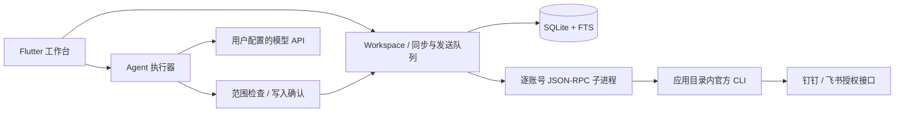

# 架构与验收范围

## 运行结构

Flutter 使用 Riverpod 提供状态，Workspace 管理账号、会话、同步和插件生命周期。Drift 管理 SQLite；记录以账号和资源 ID 组合标识，防止不同组织同名 ID 混淆。FTS5 trigram 用于较长检索，短中文查询使用子串检索。

官方 IM 通过随应用编译分发的 Dart 适配器转换命令与结构化输出。每个账号独立子进程，协议为逐行 JSON-RPC；stdout 只传协议，stderr 不直接显示，避免泄漏任意 CLI 诊断内容。第三方 IM 插件实现同一协议，Agent 插件声明提示词和允许工具。详细字段见 [插件协议](PLUGIN_PROTOCOL.md)。

## 数据与凭证

工作区位于系统 Application Support 目录的 `workspace/`，包含 SQLite、插件版本、账号配置、缓存、下载文件及更新回滚备份。单工作区使用文件锁避免多个应用进程并行同步。CLI 通过绝对路径运行，不查找系统安装的 dws/lark-cli，也不修改系统 PATH 或 HOME。

账号专用配置目录通过 CLI 支持的环境变量传入。官方 CLI 可能仍使用共享系统凭证命名空间，登录/退出前应用提示这一边界；没有自动导入、重置或迁移系统凭证。模型 API 密钥通过 flutter_secure_storage 存储。消息数据库本身未整体加密。

## 同步和写入

- 钉钉在用户关注的会话上订阅个人消息事件，并用历史查询补偿；飞书个人消息使用轮询。
- 活跃会话目标周期 5 秒、关注会话 30 秒、账号会话列表 60 秒；实际延迟受权限、CLI 耗时与限流影响。
- 消息以来源 ID 去重。历史分页与增量同步检查点分离；未补齐区间在界面显示，不能将有缺口的数据当作完整历史。
- 发送先持久化 outbox，结果区分成功、失败、未知。超时或应用中断不自动重发；由用户核对平台记录，避免重复消息。
- 官方升级暂停相关进程，验证摘要、解压受限文件、检查命令能力后激活新版本，并保存上一版与配置备份用于回滚。

## Agent 执行

通过兼容 Chat Completions 的 API 流式输出，支持 SSE 工具参数增量。会话创建后账号范围固定，改变范围需要新会话。只读工具在选定范围内自动执行；发消息、创建文档与待办先展示具体目标和内容。

确认令牌绑定账号、工具名及规范化参数摘要，只能消费一次。工具运行记录保存到本地审计；Agent 不获得任意 shell 权限。同次执行拒绝重复写入请求，并设有时间、步骤、工具数量与上下文大小上限。资料来源保存为引用，方便回到原消息或文档。

## 分发与限制

三个桌面平台共用 Dart 业务代码，原生 Runner、插件依赖与适配器在对应系统构建。`tool/package.py` 打包应用与独立适配器；官方 IM 二进制在用户点击安装后下载，无需系统预装。

第三方插件是可信本地代码，子进程隔离不等于安全沙箱。ZIP 摘要用于完整性检查，不代表发布者身份认证；当前无公共市场或签名信任库。正式系统签名、公证、完整原生 IM 功能和企业全量知识同步不属于当前交付。

验收证据与尚未执行的验证见 [验证记录](VALIDATION.md)。
